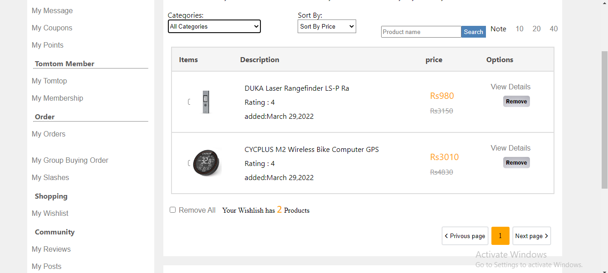
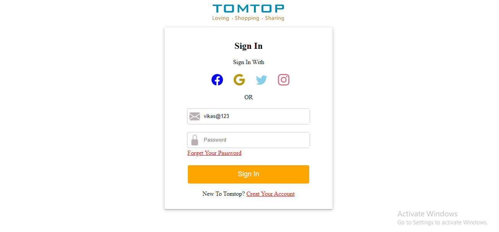
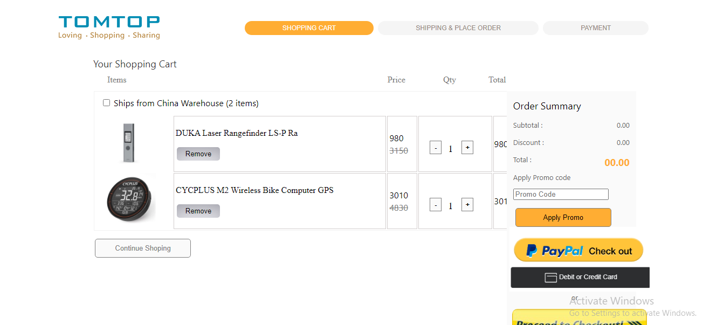
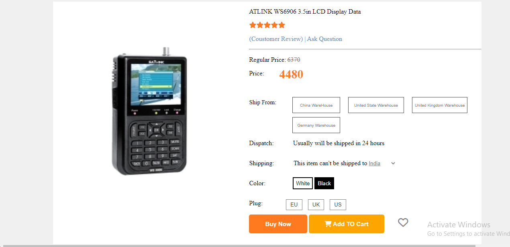
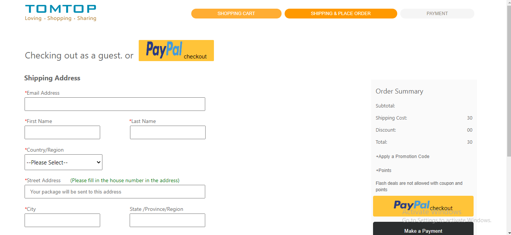

# TomTop Clone

# Masai School Construct Week Project

Welcome, we're are team “TomTopClone”, and this Readme contains detail about our project. We‘ve built a cloned website of TomTop.com with some of its basic functionalities. This overall project was a part of our construct week at Masai School.

## About Project
TomTop is US based E-Commerce website which provids products like Technical,Non-Technical and all products like which E-commerce website to be have. Building this project has been a chellenging job and fun at the same time.  

## Pages & Features

- Homepage: Basic UI with search for Cars attached to the below of navbar.
- Cars Page: Integrated search filter with category filterization and pagination.
- Sign-up & Sign-in Modal
- Car Details page for each fundraiser
- Payment Page
- FAQ 
- How it works page

## Deployment Link

https://frolicking-sprite-ca94e3.netlify.app/

## 🔗 Team Members
    1. Akshay Kanherkar

    
    2. Anubhav Mishra - Leader

    
    3. Manish Singh

    
    4. Prachita Gajhbiye

    
    5. Vikas Pawar

<h2>Here are some screenshots of the clone website</h2>

<h2> Homepage :- </h2>

<h2> Favorites Page :- </h2>

<h2> Login Page :- </h2>

<h2> Cart Page :- </h2>

<h2> single Product Page :- </h2>

<h2> Payment Page :- </h2>

## Feedback

If you have any feedback, please reach out to us at our respective linkedin profiles mentioned above

## Installation

- Clone my project
- Just click on homepage.html
